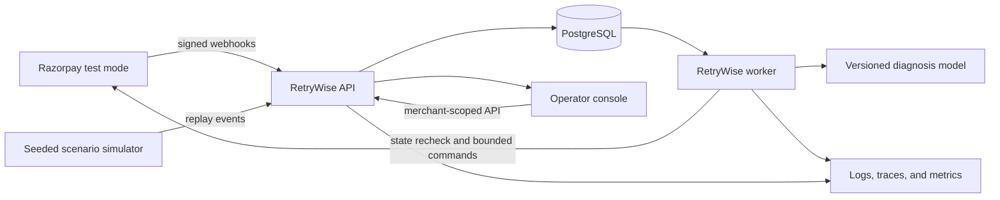
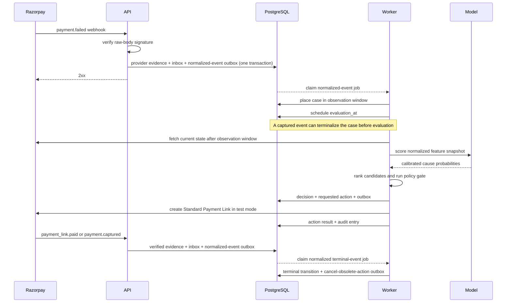

# RetryWise system architecture

## 1. Architecture decision

RetryWise is a modular monolith designed for three runtime roles:

1. A stateless HTTP API receives Razorpay webhooks and serves the operator console.
2. A worker evaluates cases and executes scheduled or external actions.
3. A web console presents incidents, cases, policies, evidence, and evaluation runs.

The API and worker share a Python domain package but never share in-memory state. PostgreSQL is the authority. The API commits verified provider evidence plus inbox/outbox ingress state; the executable worker composes failure enrichment, failure and terminal projection, assessment scheduling, approvals, Payment Link creation, protective cancellation, result persistence, and audit writes. The transactional outbox is the only supported bridge from a committed domain transition to an external side effect.

Current build status: the complete handler graph is registered by `retrywise-worker`. Docker Compose contains PostgreSQL, a one-shot migrator, the API, and an opt-in `razorpay-test` worker profile. The worker refuses to compose without an enrolled Test credential snapshot, durable outbox readiness, and explicit `razorpay_test` effect mode. API readiness requires a fresh exact-revision worker heartbeat whenever that effect mode is enabled.

This shape is intentional. Kafka, Temporal, a feature store, a vector database, and independent microservices would add operational surface without strengthening the current reliability requirements. The internal contracts preserve a future migration path if load or team ownership later justifies separation.

## 2. Quality attributes

The order matters:

1. **Financial safety:** never create an unsafe or duplicate recovery action.
2. **Auditability:** explain and replay every material decision.
3. **Correctness under retries:** tolerate duplicate and out-of-order provider events.
4. **Honest measurement:** separate real test-mode results from simulation.
5. **Operator clarity:** make uncertainty and blocked actions visible.
6. **Latency:** begin evaluation within seconds without sacrificing the observation window.
7. **Scalability:** partition cleanly by merchant and provider account.

## 3. System context

This is the implemented runtime context. A credentialed external Test Mode run
remains a release gate; it is not represented as completed by this diagram.



## 4. Internal modules

### 4.1 Webhook ingress

- Reads the raw request body before JSON parsing.
- Selects the merchant webhook secret by endpoint identity, not by payload data.
- Verifies the Razorpay HMAC with constant-time comparison.
- Binds the signed payload `account_id` to the same tenant-scoped, enabled Razorpay TEST account row at readiness, transactional write, and database-trigger layers.
- Requires a provider event identifier and stores it under a unique constraint.
- Persists the body digest, normalized metadata, verification result, receive time, and provider time.
- Returns quickly after the event and outbox message commit.
- Never calls an AI model or Razorpay API in the request path.

### 4.2 Normalizer

The normalizer converts supported provider payloads into versioned domain events such as:

- `PaymentFailed`
- `PaymentCaptured`
- `PaymentLinkPaid`
- `PaymentDowntimeStarted`
- `PaymentDowntimeUpdated`
- `PaymentDowntimeResolved`

The current adapter persists an immutable raw-body digest plus the strict canonical allowlist. It deliberately does not retain the complete webhook entity because those payloads can contain contact data and free-form notes. If legal/audit requirements later require raw evidence, add a separate encrypted, access-controlled, expiring evidence store; domain events still contain only fields required for recovery and analysis.

The worker handles strict `payment.failed`, `payment.captured`,
`payment_link.paid`, and `payment_link.partially_paid` evidence. A failed payment
that cannot be mapped from existing state is first enriched with fresh Razorpay
Payment and Order reads. Failure projection creates or reuses one observing case
while newer authorized/captured/refunded truth dominates stale failure. Terminal
projection advances monotonic payment/order/instrument truth and can schedule
protective cancellation. Downtime webhooks are normalized at ingress but runtime
incident evidence currently comes from persisted detector/method-health state.

The late-capture observation floor begins from trusted receive/database time, not the provider's payload occurrence timestamp. Provider time remains evidence only; it cannot shorten the two-minute minimum enforced again by PostgreSQL.

### 4.3 Recovery-case aggregate

The aggregate owns the recovery state machine and rejects invalid transitions. It does not perform I/O. Each accepted command returns domain events and requested effects.

Core commands include:

- `observe_failure`
- `record_late_capture`
- `mark_ready_for_evaluation`
- `record_decision`
- `request_approval`
- `authorize_action`
- `record_action_result`
- `stop_case`
- `escalate_case`

### 4.4 Incident detector

The detector evaluates failures by merchant, payment method, and affected instrument. It combines:

- Razorpay downtime events or a current downtime read.
- Recent failure volume and rate.
- A historical baseline with minimum-volume protection.
- Error-source, error-step, and error-reason concentration.

Provider-confirmed downtime is authoritative evidence. Statistical detection is a complementary signal, not a replacement.

### 4.5 Diagnosis model

The reproducible default is an interpretable categorical Naive Bayes classifier over seven allowlisted payment and incident features. A frozen 60-row synthetic training corpus produces a canonical artifact whose SHA-256 digest identifies that Local ML version. A separate 18-row synthetic holdout is engineering smoke evidence, not a merchant-performance claim. Local ML and the optional Gemini classifier share the same small failure taxonomy:

- `provider_incident`
- `customer_correctable`
- `credential_permanent`
- `funds_temporary`
- `merchant_integration`
- `unknown`

The router supports three merchant-scoped modes. `LOCAL_ML` uses only the pinned artifact. `HYBRID_GEMINI` requests strict JSON from Gemini over the redacted categorical vector; schema-valid output is also checked for an exact 10,000-basis-point sum, taxonomy membership, and winner/probability agreement. Timeout, rate limit, unavailability, malformed output, or an open circuit immediately selects Local ML and adds a fallback abstention, which forces human approval. `SHADOW` keeps Local ML authoritative and stores Gemini agreement for comparison.

Neither engine returns an executable instruction. Diagnosis returns probabilities, model/version provenance, safe categorical evidence, and OOD/low-confidence abstention. Gemini never receives identifiers, amount, customer/contact fields, free-form notes, credentials, or tools. The deterministic gate is the only planning authority, and the isolated effect worker repeats fresh-truth and version checks before it can call Razorpay.

### 4.6 Recovery policy

The policy engine creates candidates from a closed action catalog:

- `wait`
- `create_standard_payment_link`
- `notify_existing_link`
- `cancel_payment_link`
- `escalate`
- `stop`

It estimates each permitted candidate's value:

```text
expected_value =
  payment_amount * predicted_recovery_probability
  - incentive_cost
  - communication_cost
  - customer_friction_penalty
  - duplicate_collection_risk
```

The expected-value score ranks candidates. The deterministic gate decides whether the winner is allowed.

### 4.7 Policy gate

The gate is pure, versioned code. It evaluates:

- Current payment and order status.
- Late-capture observation deadline.
- Existing active recovery actions.
- Retry and contact limits.
- Quiet hours and channel consent.
- Amount-based approval thresholds.
- Active downtime affecting the proposed method.
- Merchant kill switch and automation budget.
- Case version and terminal status.

A blocked action is written to the decision ledger with explicit reason codes.

### 4.8 Action executor

The worker executes provider commands only after:

1. Claiming the outbox job with a lease.
2. Loading the latest case version.
3. Re-fetching current provider state when the command can collect money.
4. Re-running the deterministic gate.
5. Acquiring or checking the action idempotency key.

The executor records bounded request metadata, provider response metadata,
outcome, retry classification, durable instrument state, and audit evidence.
Secrets and raw customer details are redacted.

The protective cancellation executor applies a stricter final boundary. Its
version-one command binds the merchant, case, action, instrument, provider
account, Payment Link, controller-derived provider reference, amount, and
currency. It requires an exact durable row projection, fresh provider truth,
a second durable read, exact zero `amount_paid` evidence, and a second fresh
effect decision immediately before the cancel call. Every write result,
including nominal success, forces a provider re-fetch and durable-binding
recheck; paid/partially-paid truth opens review rather than reporting success. A
reclaimed lease first reconciles without calling cancel and may grant a bounded
same-effect retry only after exact created/unpaid truth. Its PostgreSQL binding
reader, scheduler, result writer, and handler are registered in the worker.

### 4.9 Decision ledger

The domain ledger is append-only and hash chained per recovery case:

```text
entry_hash = SHA256(canonical_entry_json || previous_entry_hash)
```

It is not a blockchain and should never be marketed as one. The domain
implementation computes and verifies canonical hashes; PostgreSQL constraints
enforce append-only rows, serialized sequence allocation, and prior-hash
continuity. The transaction-scoped PostgreSQL audit appender enforces the
application hash profile, privacy boundary, and caller-owned transaction. It is
used by assessment, approval, create, and cancellation transitions; an
authenticated API and console surface recompute the persisted chain.

## 5. Implemented end-to-end event flow

The sequence below is implemented and covered with deterministic adapter and
repository tests. The remaining release gate is execution against an accessible
PostgreSQL daemon and a merchant's real Razorpay Test account.



## 6. Consistency and delivery semantics

The schema and worker implement **at-least-once processing with effect-level
convergence**, not fictional exactly-once delivery. Unit and contract tests cover
the fences and ambiguity policies; a live PostgreSQL crash/concurrency run is
still required before deployment evidence is complete.

- `provider_events(provider_account_id, provider_event_id)` is unique.
- Every domain command includes the expected aggregate version.
- Every external action has a stable idempotency key derived from merchant, case, action type, and decision version.
- Only one active collection action may exist per case.
- Outbox jobs use leases, bounded exponential backoff, and a dead-letter state.
- A mapped terminal payment event dominates pending recovery work; a previously unseen terminal payment is correlated only through exact signed/provider identifiers, and an obsolete collectable link is scheduled for fenced cancellation.
- Provider state is re-read before any potentially collecting action.

## 7. Data boundaries

### Required operational data

- Merchant and provider-account identifiers.
- Provider payment, order, and Payment Link identifiers.
- Amount in minor units and ISO currency.
- Payment method and non-sensitive instrument classification.
- Error facets, timestamps, case state, policy decisions, and outcomes.

### Data deliberately not stored

- Card PAN, CVV, UPI PIN, bank credentials, or payment tokens.
- Full webhook secrets or API secrets in the database unless encrypted by a managed key service.
- Customer message content beyond the final approved template identifier and redacted preview.

Customer email and phone data should remain at Razorpay when the selected action can use Razorpay notification delivery. If a future channel needs contact data, add an explicit retention, encryption, access, and deletion design first.

## 8. Observability

Every request, provider event, case, decision, action, and model invocation carries a correlation identifier. Required signals include:

- Webhook verification failures and dedupe rate.
- Event-to-normalization and evaluation latency.
- Cases by state and age.
- Incident detector alerts and confirmation rate.
- Actions proposed, blocked, approved, executed, and failed.
- Recovery amount by actual test mode, replay, and simulation source.
- Stop-rule violations and duplicate-collection attempts, both targeted at zero.
- Model drift, calibration, and abstention rate.
- Outbox queue age, retry count, and dead-letter count.

## 9. Deployment topology

Target deployment topology:

- Console: standard Next.js service with server-only control-plane proxy routes.
- API: one container with FastAPI.
- Worker: the same immutable image with the `retrywise-worker` polling, scheduling, projection, approval, effect, and cancellation entry point.
- Database: managed PostgreSQL.
- Secrets: deployment secret manager, never frontend variables.
- Provider ingress: one stable HTTPS endpoint with a merchant-specific path token.

Sandbox and production process profiles require a single-host TCP PostgreSQL URI
and an executable TLS policy that forces libpq `sslmode=verify-full`. Certificate
chain and hostname verification therefore occur on the actual connector, not as
a documentation-only DSN convention. Local Replay/Compose may explicitly keep
TLS disabled on its isolated database network. Credential-bearing DSNs are never
stored in the settings object or returned by diagnostics.

Outbound Razorpay adapter construction is separately fail-closed. Credential
binding loads an initial account generation, resolves managed-secret material
outside a database transaction, then reacquires a short `FOR SHARE` lock and
requires the row generation, duplicated metadata, and enrolled key-ID digest to
remain unchanged before adapter construction. This is version-fenced operational
metadata attestation, not provider-issued proof that the key owns the stated
Razorpay account. The deployment composes a read-only mounted-file resolver.
Raw API key/secret environment variables are rejected so the worker has one
authoritative credential source. Enrollment makes a read-only Razorpay Test API
call before writing files, and worker startup re-attests the exact database
generation and key-ID digest before becoming ready.

Local Docker Compose provides PostgreSQL, a fail-closed one-shot migrator, the
API, and an opt-in `razorpay-test` worker profile. The console runs separately.
Simulator paths and injected test doubles support offline evaluation; there is
no runtime offline Payment Link effect adapter.

## 10. Scale-out path

Only after evidence demands it:

1. Partition event and case tables by merchant or time.
2. Move the outbox transport to a managed queue while preserving event contracts.
3. Separate incident detection and action execution by ownership or scaling profile.
4. Add a managed feature store only when online/offline feature parity becomes a demonstrated problem.
5. Add multi-region ingest only after defining provider webhook routing and data residency.

The first production-quality version wins through invariants, evidence, and execution depth - not component count.
