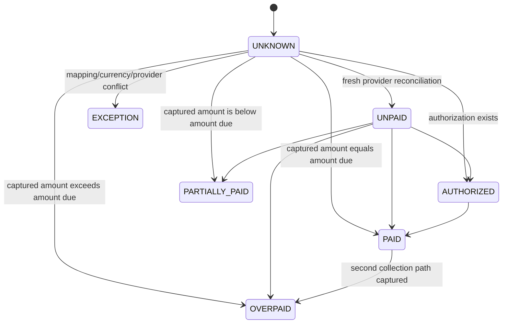
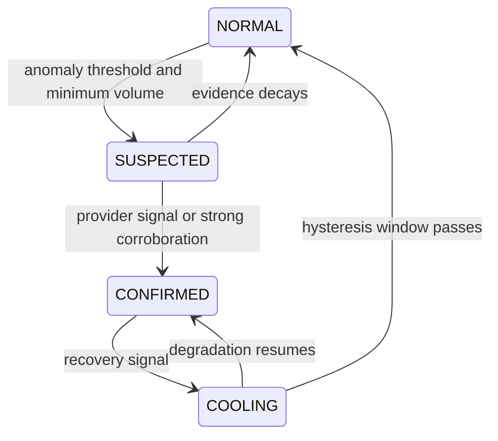

# RetryWise state machines

This document defines the implemented transition contract. Pure aggregate rules,
PostgreSQL constraints, and the executable worker share the same boundaries.
The worker handles failed-payment enrichment and projection, scheduled
assessment, approval materialization, Payment Link creation, terminal payment
projection, and protective cancellation.

RetryWise models three independent truths. Combining them into one large enum would hide important races and create invalid transitions.

## 1. Canonical payment truth

Canonical truth is computed for the merchant's logical order across the original Razorpay order/payments and every RetryWise-created Payment Link.

Rules:

- Money is always an integer in the currency's smallest unit.
- Only `UNPAID` permits a new collection action.
- `UNKNOWN`, `AUTHORIZED`, `PARTIALLY_PAID`, `PAID`, `OVERPAID`, and `EXCEPTION` all fail closed.
- A Payment Link is a separate collection path with its own Razorpay order, not a retry attached to the original order.
- A paid provider order can remain paid after a refund, so refund truth is tracked separately.

## 2. Recovery workflow

```mermaid
stateDiagram-v2
    [*] --> OBSERVING: eligible verified failure
    OBSERVING --> SUPPRESSED_PAID: original path succeeds
    OBSERVING --> ASSESSING: observation deadline
    ASSESSING --> WAITING: incident/cooldown
    ASSESSING --> APPROVAL_REQUIRED: high value or uncertainty
    ASSESSING --> ACTION_QUEUED: action passes gate
    ASSESSING --> EXHAUSTED: no positive permitted action
    ASSESSING --> SUPPRESSED_POLICY: stop rule
    WAITING --> ASSESSING: wakeup/revalidation
    APPROVAL_REQUIRED --> ACTION_QUEUED: version-bound approval
    APPROVAL_REQUIRED --> SUPPRESSED_POLICY: rejected/expired
    ACTION_QUEUED --> EXECUTING
    EXECUTING --> ACTIVE: provider result certain
    EXECUTING --> ACTION_UNCERTAIN: accepted result may be lost
    EXECUTING --> FAILED_SAFE: non-retryable safe failure
    ACTION_UNCERTAIN --> ACTIVE: lookup finds existing link
    ACTION_UNCERTAIN --> ACTION_QUEUED: lookup proves no link exists
    ACTION_UNCERTAIN --> ESCALATED: state cannot be reconciled
    ACTIVE --> RECOVERED: recovery link paid and original unpaid
    ACTIVE --> SUPPRESSED_PAID: original path paid; link cancelled/expired
    ACTIVE --> ASSESSING: link expired and budget remains
    ACTIVE --> EXHAUSTED: no successor permitted
    ACTIVE --> DUPLICATE_REVIEW: both collection paths paid
    SUPPRESSED_PAID --> DUPLICATE_REVIEW: later second capture detected
```

Collection-terminal states are monotonic. A later overpayment opens `DUPLICATE_REVIEW`; it does not reopen collection.

The `OBSERVING` deadline has an immutable 120-second minimum late-capture floor. It starts from trusted receive/database time, not the provider-supplied occurrence timestamp. Diagnosis may lengthen that window, but it cannot shorten it. The aggregate persists `observation_started_at` and `observation_deadline`; the policy and effect gates both reject collection before the deadline; and PostgreSQL migration `004` assigns the trusted start, clamps a shorter caller deadline upward, and blocks an early `OBSERVING` to `ASSESSING` transition using database time. Pre-hardening rows without trusted timing evidence are explicitly barred from advancing into collection states. This remains true for apparently permanent failures such as an expired credential because a provider event is only a snapshot and the original attempt may still transition later.

`ACTION_UNCERTAIN` is mandatory. If a Payment Link create request times out after Razorpay accepted it, the worker must search by the deterministic `reference_id`. It must never create a new reference and blindly repeat the effect.

## 3. Incident state

Incident state exists per scope such as `(merchant, method, bank/network/issuer)`.

- Every incident has a TTL.
- Hysteresis prevents state flapping.
- Provider-confirmed downtime is authoritative evidence.
- Internal detection is corroboration and early warning, not a substitute for the provider feed.

## 4. Critical workflow transitions

| Current | Input | Guard | Next | Effects |
| --- | --- | --- | --- | --- |
| none | verified `payment.failed` | no active case for logical order | `OBSERVING` | schedule evaluation; append evidence |
| `OBSERVING` | original capture/order paid | canonical truth `PAID` | `SUPPRESSED_PAID` | revoke planned action |
| `OBSERVING` | observation deadline | canonical truth freshly `UNPAID` | `ASSESSING` | freeze feature snapshot |
| `ASSESSING` | selected action | all deterministic checks pass | `ACTION_QUEUED` | audit intent; enqueue command |
| `ASSESSING` | amount/confidence threshold | approval required | `APPROVAL_REQUIRED` | create version-bound approval |
| `EXECUTING` | create timeout | acceptance ambiguous | `ACTION_UNCERTAIN` | reconcile by `reference_id` |
| `ACTION_UNCERTAIN` | link found | reference belongs to case | `ACTIVE` | adopt provider link; do not recreate |
| `ACTIVE` | `payment_link.paid` | original path remains unpaid | `RECOVERED` | measure actual test-mode recovery |
| any nonterminal | original path paid | active link not paid | `SUPPRESSED_PAID` | cancel link if possible |
| any | both paths captured | canonical truth `OVERPAID` | `DUPLICATE_REVIEW` | stop actions; alert for manual compensation |

## 5. Concurrency invariants

1. A recovery aggregate mutates only with optimistic version checking.
2. At most one recovery instrument may be `CREATING`, `UNCERTAIN`, `ISSUED`, `ACTIVE`, or `CANCEL_PENDING` for a logical order and currency.
3. Provider events are unique by provider account and provider event ID.
4. Every action execution is bound to one immutable decision and deterministic action key.
5. A stale approval cannot authorize a new case or decision version.
6. No terminal collection state returns to collection.
7. The cancellation control action converges through fresh reconciliation; it is not independently terminal. Paid, partially-paid, or original-payment truth dominates even after a cancelled response and can open duplicate review.
8. Canonical truth is re-read immediately before a money-adjacent effect.
